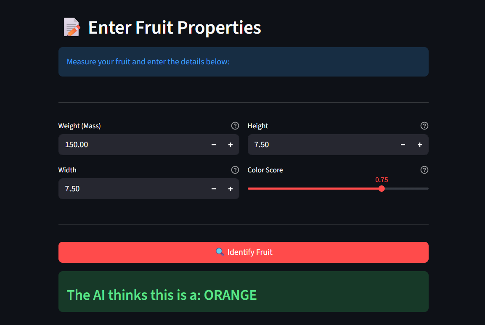
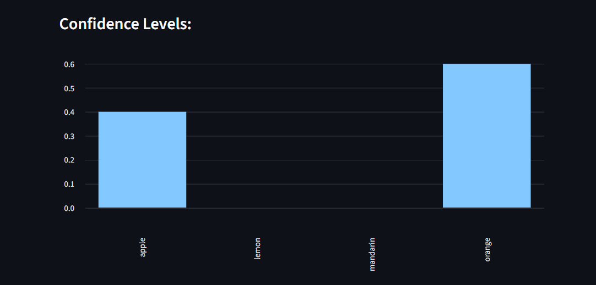
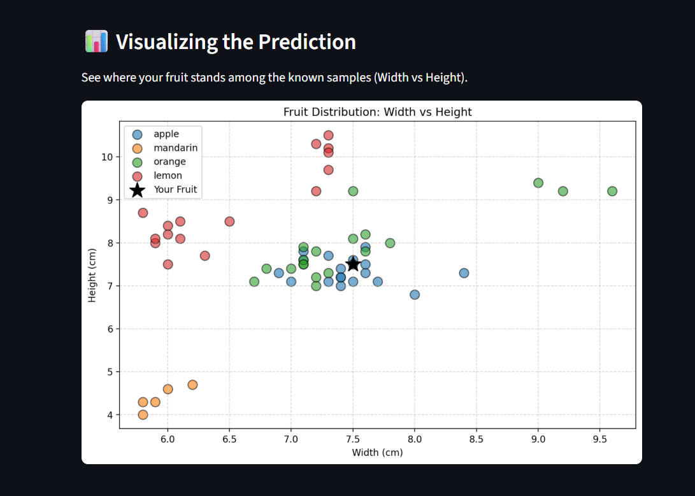
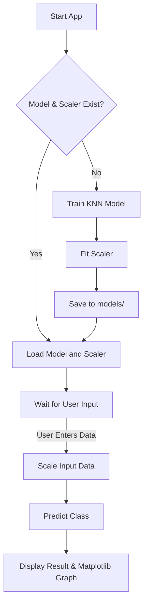

# 🍎 FruitVision – KNN-based Fruit Classifier


## 📖 Table of Contents
- [Overview](#-overview)
- [Project Screenshots](#-project-screenshots)
- [Machine Learning Concepts Used](#-machine-learning-concepts-used)
- [Project Workflow](#-project-workflow)
- [Project Structure](#-project-structure)
- [Dataset](#-dataset)
- [Libraries Used](#-libraries-used)
- [How to Run Locally](#-how-to-run-locally)
- [How to Deploy](#-how-to-deploy-streamlit-cloud)
- [What I Learned](#-what-i-learned)
- [Detailed Concepts](#-detailed-concepts)
- [Future Improvements](#-future-improvements)
- [Contact Me](#-contact-me)


## 📌 Overview
This project is an **Interactive Fruit Classifier Web App** built with **Streamlit** and **Scikit-Learn**. It uses the **K-Nearest Neighbors (KNN)** algorithm to identify fruits (Apple, Mandarin, Orange, Lemon) based on their physical features like mass, width, height, and color score.

### Why this project?
Machine Learning often feels like magic. This project breaks it down into a simple, interactive tool. By adjusting sliders for fruit properties, you can see exactly how an AI decides what fruit it is looking at. It demystifies concepts like **Scaling**, **Training**, and **Prediction**.


## 📸 Project Screenshots

Here is the app in action:

| Section | Screenshot |
| :--- | :--- |
| **Main Interface**<br>Clean User Input Form |  |
| **Prediction Result**<br>Instant Classification |  |
| **Visual Analysis**<br>KNN Visualization |  |


## 🧠 Machine Learning Concepts Used

| Concept | Description | Why it's used here? |
| :--- | :--- | :--- |
| **K-Nearest Neighbors (KNN)** | A "lazy" algorithm that classifies new data based on its closest neighbors. | Simple and effective for classification based on physical dimensions. |
| **MinMax Scaling** | Shrinks all data to be between 0 and 1. | Ensures `Mass` (150g) doesn't overpower `Width` (7cm) when calculating mathematical distance. |
| **Train-Test Split** | Hides a portion of data during training. | Allows us to "test" the model on data it has never seen to prove it works. |


## 🧠 Project Workflow



## 📂 Project Structure
```text
project_2/
├── data/
│   └── fruits_data_with_colors.csv   # Kaggle Dataset (Fruits with Colors)
├── images/                           # Screenshots 
│   ├── screenshot-1.png
│   ├── screenshot-2.png
│   └── screenshot-3.png
├── models/
│   ├── fruit_knn_model.pkl           # Saved KNN Model 
│   └── scaler.pkl                    # Saved Scaler 
├── src/
│   └── main.py                       # Streamlit Application
├── .gitignore
├── requirements.txt
└── README.md
```


## 📊 Dataset
**Source**: [Fruits with Colors Dataset](https://www.kaggle.com/datasets/mjamilmoughal/fruits-with-colors-dataset)

| Feature | Unit | Description |
| :--- | :--- | :--- |
| `mass` | Grams (g) | Weight of the fruit. |
| `width` | Centimeters (cm) | The widest part of the fruit. |
| `height` | Centimeters (cm) | The tallest part of the fruit. |
| `color_score` | 0.0 - 1.0 | A numerical score representing color spectrum. |
| **Target** | Label | The specific fruit name (`apple`, `mandarin`, `orange`, `lemon`). |


## 🛠 Libraries Used

| Library | Purpose |
| :--- | :--- |
| **pandas** | "Excel for Python" - Used to load and read the CSV dataset. |
| **matplotlib** | Plotting library - Used to draw the scatter plot graph. |
| **scikit-learn** | The ML Brain - Contains the KNN algorithm and Scaler. |
| **streamlit** | Web App - Turns the Python script into the UI you see in the browser. |
| **joblib** | Memory - Saves the trained model to disk so we don't allow "amnesia". |


## ▶️ How to Run Locally

1.  **Install Dependencies**:
    ```bash
    pip install -r requirements.txt
    ```

2.  **Run the App**:
    ```bash
    streamlit run src/main.py
    ```

3.  **Open in Browser**:
    Go to `http://localhost:8501`.


## ☁️ How to Deploy (Streamlit Cloud)

1.  **Push to GitHub**: Upload this project repository to GitHub.
2.  **Streamlit Cloud**: Login to [share.streamlit.io](https://share.streamlit.io/).
3.  **New App**: Select your repo and branch.
4.  **Configuration**: Set Main file path to `src/main.py`.
5.  **Deploy**: Click "Deploy" to launch!


##  What I Learned
- **Input Scaling**: Learned that K-Nearest Neighbors counts "Distance" mathematically. If one number is big (100) and one is small (1), the big number dominates. Scaling fixes this.
- **Model Persistence**: Keeping the `scaler.pkl` is just as important as the model. If we scale the training data but forget to scale the user's input, the prediction will be junk.
- **User Experience**: A good UI with tooltips and clear units (g, cm) prevents user errors.


## 📚 Detailed Concepts

### 🧠 How It Works (The Core Concepts)

#### 1. How the Model Works (KNN)
**K-Nearest Neighbors (KNN)** is one of the simplest and most intuitive ML algorithms.
*   **Analogy**: You move to a new town. To decide if a restaurant is good, you ask 5 neighbors. If 4 say "Good", you assume it's good.
*   **In this App**: The model looks at the 5 fruits in the database that are most similar (closest in size/color) to your input. The majority vote wins.

#### 2. How Training Works (`fit`)
*   **Training** in KNN is lazy! It doesn't actually "learn" a complex formula.
*   It simply memorizes the training data like a phone book.
*   `model.fit()` basically says: "Okay, I have stored these 50 examples in my RAM."

#### 3. How Prediction Works (`predict`)
*   When you click "Identify Fruit":
    1.  **Input**: User enters `Mass=150`, `Width=7.5`.
    2.  **Scale**: We convert this to `Mass=0.5`, `Width=0.6` (relative to max values).
    3.  **Distance**: The model uses the **Euclidean Distance Formula**: $\sqrt{(x_2-x_1)^2 + (y_2-y_1)^2}$ to find the distance between your fruit and every fruit in memory.
    4.  **Vote**: It picks the top 5 closest matches and counts the votes.

### 🧪 How to Test and Experiment
1.  **Run the App**: Open it in your browser.
2.  **Try Extremes**: Input a very heavy fruit (Mass=350g). Does it predict Orange (which are usually heavy)?
3.  **Try Small Fruits**: Input a tiny fruit (Mass=80g, Width=5cm). Does it predict Mandarin?
4.  **Check Confidence**: Look at the bar chart. If the bar is 100% for Apple, the model is very sure. If it's 50/50, your input is confusingly similar to two fruits!

### 📊 Understanding the Output
*   **Label**: The final decision (e.g., "APPLE").
*   **Confidence levels**: Shows the probability distribution. A lower confidence means the fruit is on the "borderline" between types.
*   **Scatter Plot**:
    *   **Colored Dots**: Real fruits from the dataset.
    *   **Black Star**: YOUR input.
    *   **Goal**: If your star lands inside a cluster of similar points, the prediction is likely correct.


## 🚀 Future Improvements
- **Add More Fruits**: Train the model on a larger dataset with bananas, grapes, etc.
- **Real-time Prediction**: Allow users to upload an image of a fruit for classification (using OpenCV).
- **3D Visualization**: Upgrade the 2D scatter plot to a 3D interactive graph.


## 🔗Contact Me

-   **Email:**  [agrahari0899@gmail.com](mailto:agrahari0899@gmail.com)
-   **GitHub:** [@saksham2882](https://github.com/saksham2882)
-   **LinkedIn:** [@saksham-agrahari](https://www.linkedin.com/in/saksham-agrahari/)
-   **Portfolio:** [saksham-agrahari.vercel.app](https://saksham-agrahari.vercel.app)

---

<p align="center">
  Made with ❤️ by Saksham Agrahari
</p>

---